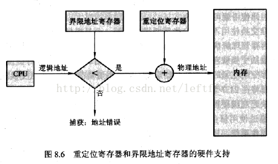

<!-- GFM-TOC -->
* [进程](#进程)
    * [进程的同步](#进程的同步)
    * [进程的通信](#进程的通信)
* [协程](#协程)
* [存储管理](#存储管理)
    * [内存管理](#内存管理)
    * [虚拟内存](#虚拟内存)
    * [页面置换](#页面置换)
    * [Buffer和Cache](#buffer和cache)
    * [Cache写机制](#cache写机制)
    
<!-- GFM-TOC -->
## 进程
#### 线程及状态
#### 线程的生命周期
#### 线程池
#### 线程间的通信机制

### 进程及状态
### 进程与线程的区别
### 进程同步和线程同步

### 进程的同步
#### 临界区
临界区：访问临界资源的代码，为访问临界资源，每个进程在进入临界区之前，需要先进行检查。
#### 同步、互斥、异步
- 同步：多个进程按一定顺序执行
- 互斥： 多个进程在同一时刻只有一个进程能进入临界区。
- 异步：
#### 信号量
信号量(Semaphore)——整型变量大于0，为0时时睡眠进程，可对其进行P操作（dwon 信号量--），V操作（up 信号量++）。
P操作和V操作被设计程原语不可分割，通常的做法是在执行这些操作的时候屏蔽中断。

- 信号量(取值为0或者1)变成互斥量(Mutex)，0表临界区加锁，1表示临界区解锁
```c++
typedef int semaphore;
semaphore mutex = 1;
void P1() {
    down(&mutex);
    // 临界区
    up(&mutex);
}

void P2() {
    down(&mutex);
    // 临界区
    up(&mutex);
}
```

- 生产者-消费者问题:使用一个缓冲区来保存物品，只有缓冲区没有满，生产者才可以放入物品；只有缓冲区不为空，消费者才可以拿走物品。

1. 缓冲区为临界资源，需要一个互斥量（mutex）来控制互斥访问。
2. 采用两个信号量：empty——记录空缓存数量；full——记录满缓冲区的数量。

* 注意，不能先对缓冲区进行加锁，再测试信号量。也就是说，不能先执行 down(mutex) 再执行 down(empty)。如果这么做了，那么可能会出现这种情况：生产者对缓冲区加锁后，执行 down(empty) 操作，发现 empty = 0，此时生产者睡眠。消费者不能进入临界区，因为生产者对缓冲区加锁了，消费者就无法执行 up(empty) 操作，empty 永远都为 0，导致生产者永远等待下，不会释放锁，消费者因此也会永远等待下去。
```c++
#define N 100
typedef int semaphore;
semaphore mutex = 1;
semaphore empty = N;
semaphore full = 0;

void producer() {
    while(TRUE) {
        int item = produce_item();
        down(&empty);
        down(&mutex);
        insert_item(item);
        up(&mutex);
        up(&full);
    }
}

void consumer() {
    while(TRUE) {
        down(&full);
        down(&mutex);
        int item = remove_item();
        consume_item(item);
        up(&mutex);
        up(&empty);
    }
}
```
#### 管程
管程：在一个时刻只能有一个进程使用管程。进程在无法继续执行的时候不能一直占用管程，否者其它进程永远不能使用管程。
管程引入了条件变量以及相关的操作：wait() 和 signal() 来实现同步操作。对条件变量执行 wait() 操作会导致调用进程阻塞，把管程让出来给另一个进程持有。signal() 操作用于唤醒被阻塞的进程。
### 经典的同步问题
1. 读者-写者问题：允许多个进程同时对数据进行读操作，但是不允许读和写以及写和写操作同时发生。

一个整型变量 count 记录在对数据进行读操作的进程数量，一个互斥量 count_mutex 用于对 count 加锁，一个互斥量 data_mutex 用于对读写的数据加锁。
```c++
typedef int semaphore;
semaphore count_mutex = 1;
semaphore data_mutex = 1;
int count = 0;

void reader() {
    while(TRUE) {
        down(&count_mutex);
        count++;
        if(count == 1) down(&data_mutex); // 第一个读者需要对数据进行加锁，防止写进程访问
        up(&count_mutex);
        read();
        down(&count_mutex);
        count--;
        if(count == 0) up(&data_mutex);
        up(&count_mutex);
    }
}

void writer() {
    while(TRUE) {
        down(&data_mutex);
        write();
        up(&data_mutex);
    }
}
```
### 哲学家进餐问题
五个哲学家围着一张圆桌，每个哲学家面前放着食物。哲学家的生活有两种交替活动：吃饭以及思考。当一个哲学家吃饭时，需要先拿起自己左右两边的两根筷子，并且一次只能拿起一根筷子。

下面是一种错误的解法，考虑到如果所有哲学家同时拿起左手边的筷子，那么就无法拿起右手边的筷子，造成死锁。
为防止死锁的发生，设置两个条件
1. 必须同时拿起左右两根筷子
2. 只有在两个邻居都没有进餐的情况下才允许进餐
```c++
#define N 5
#define LEFT (i + N - 1) % N // 左邻居
#define RIGHT (i + 1) % N    // 右邻居
#define THINKING 0
#define HUNGRY   1
#define EATING   2
typedef int semaphore;
int state[N];                // 跟踪每个哲学家的状态
semaphore mutex = 1;         // 临界区的互斥
semaphore s[N];              // 每个哲学家一个信号量

void philosopher(int i) {
    while(TRUE) {
        think();
        take_two(i);
        eat();
        put_two(i);
    }
}

void take_two(int i) {
    down(&mutex);
    state[i] = HUNGRY;
    test(i);
    up(&mutex);
    down(&s[i]);
}

void put_two(i) {
    down(&mutex);
    state[i] = THINKING;
    test(LEFT);
    test(RIGHT);
    up(&mutex);
}

void test(i) {         // 尝试拿起两把筷子
    if(state[i] == HUNGRY && state[LEFT] != EATING && state[RIGHT] !=EATING) {
        state[i] = EATING;
        up(&s[i]);
    }
}
```
### 进程通信
- 进程同步：控制多个进程按一定顺序执行；
- 进程通信：进程间传输信息
1. 管道：本质是文件,通过pipe函数创建，fd[0]用于读，fd[1]用于写
```c++
#include<stdio.h>
#include<unistd.h>
#include<fcntl.h>
#include<stdlib.h>

int main()
{
    int fd[2]; // 用来保存文件描述符
    pipe(fd);

    pid_t pid = fork();// 创建进程
    if(pid > 0)
    {
        // 父进程写管道，需要关闭读端
        close(fd[0]);
        int i = 0;
        for(i=10; i<20; i++)
        {
            write(fd[1], &i, sizeof(int));
            sleep(1);
        }

        close(fd[1]);// 关闭写端
        exit(0);
    }

    // 子进程读管道
    close(fd[1]); // 先关闭写端 
    int x;
    int i = 0;
    for(; i<10; i++)
    {
        read(fd[0], &x, sizeof(int));
        printf("%d ", x);
        setbuf(stdout, NULL);
    }
    close(fd[0]);
    printf("\n");

    return 0;
}
```
它具有以下限制：
- 只支持半双工通信（单向交替传输）；
- 只能在父子进程中使用。
<div align="center">  </div><br>


2. FIFO:命名管道，去除了管道只能在父子进程中使用的限制。
```c++
#include <sys/stat.h>
int mkfifo(const char *path, mode_t mode);
int mkfifoat(int fd, const char *path, mode_t mode);
```
FIFO 常用于客户-服务器应用程序中，FIFO 用作汇聚点，在客户进程和服务器进程之间传递数据。
<div align="center">  </div><br>

编程模型：进程A创建管道(mkfifo) -> 进程A写打开管道(open) -> 进程B读打开管道(open) -> 进程A开始往管道里写数据(write) ->进程B从管道中读数据(read) -> 进程A关闭管道(close) -> 进程B关闭管道(close) -> 删除管道(unlink)
进程A
```c++
#include<sys/stat.h>
#include<fcntl.h>
#include<stdio.h>

#define PIPENAME "pipetest"

int main()
{
    // 创建管道
    if(mkfifo(PIPENAME, 0666) < 0)
    {
        perror("mkfifo");
        return -1;
    }

    // 写打开管道 
    int fd = open(PIPENAME, O_WRONLY);
    if(-1 == fd)
    {
        perror("open");
        return -1;
    }

    unlink(PIPENAME);

    int i = 0;
    for(i = 0; i < 10; i++)
    {
        write(fd, &i, sizeof(i));
        printf("%d\n", i);
        sleep(1); // 这个是以秒为单位挂起
    }

    // 关闭管道
    close(fd);

    return 0;

}
```

进程B
```c++
#include<sys/stat.h>
#include<fcntl.h>
#include<stdio.h>

#define PIPENAME "pipetest"

int main()
{
    // 读打开管道
    int fd = open(PIPENAME, O_RDONLY);
    if(-1 == fd)
    {
        perror("open");
        return -1;
    }

    int num = 0;
    int i = 0;
    for(i = 0; i < 10; i++)
    {
        read(fd, &num, sizeof(int));
        printf("%d\n", num);
        fflush(stdout); // 强制刷新输出缓冲区
    }

    printf("\n");
    close(fd);

    return 0;

}
```
3. 消息队列——优点
- 消息队列可以独立于读写进程存在，从而避免了 FIFO 中同步管道的打开和关闭时可能产生的困难；
- 避免了 FIFO 的同步阻塞问题，不需要进程自己提供同步方法；
- 读进程可以根据消息类型有选择地接收消息，而不像 FIFO 那样只能默认地接收。
4. 信号量：计数器，用于为多个进程提供对共享数据对象的访问。
5. 共享存储
允许多个进程共享一个给定的存储区。因为数据不需要在进程之间复制，所以这是最快的一种 IPC。
需要使用信号量用来同步对共享存储的访问。
多个进程可以将同一个文件映射到它们的地址空间从而实现共享内存。另外 XSI 共享内存不是使用文件，而是使用使用内存的匿名段。
6. 套接字
与其它通信机制不同的是，它可用于不同机器间的进程通信。

## 协程
协程又称为微线程，是用户级轻量线程，是事件驱动的，是单个线程，多个子程序，多个子程序内部可以中断去执行另一个子程序。协程是一个执行单元，拥有自己的寄存器上下文和栈，调度切换时，将寄存器上下文和栈保存到其他地方，在切回来的时候，恢复先前保存的寄存器上下文和栈。
- 和多线程相比优点
1. 执行效率搞，子程序千幻不是线程切换，由程序自身控制，因此没有线程上下文切换的开销，线程数目越多，协程的优势越明显。
2. 无需原子操作及同步的开销不需要锁机制，只有一个线程，不存在读写冲突，对共享资源不用加锁，只要判断状态就行了。
3. 跨平台，跨体系架构，方便切换控制流，简化编程模型，高并发+高扩展性+低成本：一个CPU支持上万的协程都不是问题。所以很适合用于高并发处理。
- 缺点
无法利用多核资源：协程的本质是个单线程,它不能同时将 单个CPU 的多个核用上,协程需要和进程配合才能运行在多CPU上.当然我们日常所编写的绝大部分应用都没有这个必要，除非是cpu密集型应用。
进行阻塞（Blocking）操作（如IO时）会阻塞掉整个程序：这一点和事件驱动一样，可以使用异步IO操作来解决。
## 内存管理
### 逻辑地址与物理地址
- 逻辑地址：CPU所产生的地址，逻辑地址空间：程序所产生的所有逻辑地址集合；物理地址空间：对于的物理地址集合
- 物理地址：加载到内存地址寄存器中的地址
<div align="center">  </div><br>

## 虚拟内存
虚拟内存：将逻辑内存和物理内存分开，可以通过页面调度算法（请求页面调度，请求分段调度）实现，物理内存扩充成更大的逻辑内存。
### 物理内存与虚拟内存
- 物理内存取决于CPU的地址线条数，32位系统，寻址范围为2^32=4G,是固定的。
<div align="center">  </div><br>

- 虚拟内存的优点：
1. 既然每个进程的内存空间都是一致而且固定的（32位平台下都是4G），所以链接器在链接可执行文件时，可以设定内存地址，而不用去管这些数据最终实际内存地址，这交给内核来完成映射关系
2. 当不同的进程使用同一段代码时，比如库文件的代码，在物理内存中可以只存储一份这样的代码，不同进程只要将自己的虚拟内存映射过去就好了，这样可以节省物理内存
3. 在程序需要分配连续空间的时候，只需要在虚拟内存分配连续空间，而不需要物理内存时连续的，实际上，往往物理内存都是断断续续的内存碎片。这样就可以有效地利用我们的物理内存

### 页面置换
### Cache写机制
1. write through: 直写模式，数据更新时，同时写入缓存Cache和后端存储。优点：操作简单，每回都要访问后端存储。
2. post write: 数据更新时，先写入一个缓冲器，在合适的时间再对后端存储进行更新，优点：提高cache的访问速度，但是数据被更新两次以上，缓冲区将不够使用，被迫更新到后端存储。
3. write cache： 回写模式，数据更新时，只写入缓存cache，只有再数据被替换时，才会被写道后端。因为很多时候cache存入的时中间结果没有必要更新后端存储，优点是数据写入速度快；缺点是一旦更新后的数据未被写入存储时出现系统掉电的情况，数据将无法找回。
写操作，写入缓存缺失数据的情况，两种处理方式：
* Write allocate:方式将写入位置读入缓存，然后采用write-hit（缓存命中写入）操作。写缺失操作与读缺失操作类似。

* No-write allocate:方式并不将写入位置读入缓存，而是直接将数据写入存储。这种方式下，只有读操作会被缓存。

### ROM、RAM、CACHE
- RAM(Random Access Memory)随机存储器，如内存
- ROM(Read Only Memory)只读存储器或固化存储器 如硬盘
- Cache 高速缓冲存储器
- 寄存器：和CPU有关，寄存器是有限存贮容量的高速存贮部件，它们可用来暂存指令、数据和位址。
速度：寄存器>cache>RAM>ROM