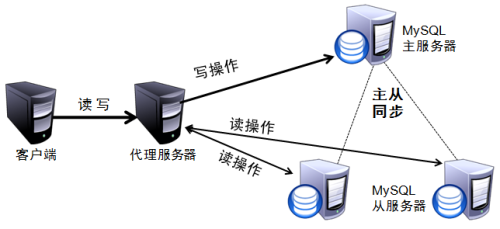

<!-- GFM-TOC -->
* [一、事务](#一-事务)
    * [概念](#概念)
    * [ACID及实现原理](#acid及实现原理)
* [redis](#redis)
* [主从复制和读写分离](#主从复制和读写分离)
<!-- GFM-TOC -->
# 一、事务
## 概念

## ACID及实现原理
<https://www.cnblogs.com/kismetv/p/10331633.html>
### 原子性(Atomicity)
* 事务是不可分割的最小单元，要么全部提交成功，要么全部失败回滚。
* 实现原理： 通过回滚日志（记录事务所执行的修改操作）实现，在执行失败时，回滚，即反向执行这些操作日志即可。在MySQL中有两中事务日志（redo log:重做日志，undo log:回滚日志），事务对数据库进行修改时，InnoDB生成undo log， 如果执行失败或调用rollback，事务回滚，撤销一层给执行的sql语句。
### 一致性(Consistency)
* 事务执行后，数据库的完整性约束没有被破坏，事务执行前后数据都是合法状态。
* 实现原理：
            1.AID三个性质必须都要满足。
            2.数据库层面的保障：例不允许在整型列插入字符串
            3.应用层面的保障：例转账余额合法。
* 数据库的完整性约束：
    实体完整性(主键约束，记录的唯一性)
    参照完整性(外键约束、外键必须是另一张表的主键有效值或NULL，可用触发器实现)
    用户定义完整性（约束是表级的强制规定:not null、unique、primary key、foreign key、check）
    域完整性(字段熟悉的约束，保证不会输入无效值)
### 隔离性(Isolation)
* 一个事务所作的修改在最终提交以前，对其他事务不可见，严格的隔离性，对硬了事务隔离级别中的可串行话。
* (一个事务)写操作对(另一个事务)写操作的影响：锁机制保证隔离性
* (一个事务)写操作对(另一个事务)读操作的影响：MVCC保证隔离性
### 持久性(Durability)
* 事务一旦提交，对数据库的修改是永恒的，即使系统崩溃，事务的执行结果也不会丢失。
* 实现原理：重做日志

    * MySQL中，InnoDB存储引擎提供了缓存(Buffur Pool)，Buffer Pool包含部数据页的映射，作为方位数据库的缓存：从数据库中读数据时，先从Buffer Pool读，如果没有，再从磁盘读取然后放入Buffer Pool；将数据写入数据库：先写入Buffer Pool，Buffer Pool中修改的数据会定期刷新到磁盘中（刷脏）。

   * Buffer Pool优点：大大提高了读写数据的效率
   * Buffer Pool缺点：如果MySQL宕机，而Buffer Pool中修改的数据未刷新到磁盘中，导致数据丢失，一致性无法保证。

    * 重做日志(redo log)可以解决这一问题，再修改数据时，不仅修改Buffer Pool的数据，还用redo log记录，事务提交时，调用fsync接口对redo log进行刷盘。如果MySQL宕机，重启时可以读取redo log中的数据，对数据库进行恢复。redo log采用的是WAL（Write-ahead logging，预写式日志），所有修改先写入日志，再更新到Buffer Pool，保证了数据不会因MySQL宕机而丢失，从而满足了持久性要求。

    * redo log也需要在事务提交时将日志写入磁盘，为什么它比直接将Buffer Pool中修改的数据写入磁盘(即刷脏)要快呢？主要有以下两方面的原因：
        1. 刷脏是随机IO，因为每次修改的数据位置随机，但写redo log是追加操作，属于顺序IO。
        2. 刷脏是以数据页（Page）为单位的，MySQL默认页大小是16KB，一个Page上一个小修改都要整页写入；而redo log中只包含真正需要写入的部分，无效IO大大减少。

### 主从复制和读写分离
主从复制必须保证主从数据库版本一致，MYSQL主（master）从(slave)复制的原理：
1. master将数据修改变化记录到二进制日志中（binary log），也是配置文件log-bin指定的文件（二进制事务文件，binary log events）
2. slave将master的binary log events拷贝到自己的中继日志（relay log）
3. slave重做中继日志的事务，将改变反映自己的数据（数据重演）

1. mysq支持的复制类型
- 基于语句的复制:在服务器上执行sql语句，在从服务器上执行同样的语句，mysql默认采用基于语句的复制，执行效率高。
- 基于行的复制:把改变的内容复制过去，而不是把命令在从服务器上执行一遍。
- 混合类型的复制。默认采用基于语句的复制，一旦发现基于语句无法精确复制时，就会采用基于行的复制。

读写分离：一般针对数据库读负载太重的情况，（写负载太重的情况可以用缓存），消除读写冲突从而提升数据库的写性能，将读负载分担到多个从服务器上。读写分离就是在主服务器上修改，数据会同步到从服务器，从服务器只能提供读取数据，不能写入，实现备份的同时也实现了数据库性能的优化，以及提升了服务器安全。

  
 

Mysql读写分离分为以下两种：
- 基于程序代码内部实现：在代码中根据select 、insert进行路由分类，这类方法也是目前生产环境下应用最广泛的。优点是性能较好，因为程序在代码中实现，不需要增加额外的硬件开支，缺点是需要开发人员来实现，运维人员无从下手。
- 基于中间代理层实现：代理一般介于应用服务器和数据库服务器之间，代理数据库服务器接收到应用服务器的请求后根据判断后转发到，后端数据库，有以下代表性的程序。
    * mysql_proxy： Mysql的一个开源项目，通过其自带的lua脚本进行sql判断。
    * Atlas: 由 Qihoo 360, Web平台部基础架构团队开发维护的一个基于MySQL协议的数据中间层项目。在mysql-proxy 0.8.2版本的基础上，对其进行了优化，增加了一些新的功能特性。360内部使用Atlas运行的mysql业务，每天承载的读写请求数达几十亿条。支持事物以及存储过程。
    * Amoeba: 由阿里巴巴集团使用序java语言进行开发，在用户生产环境下，但是他并不支持事物以及存数过程。

