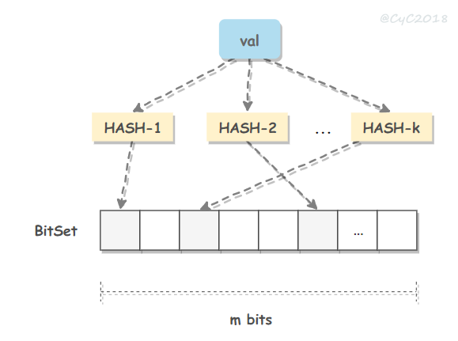
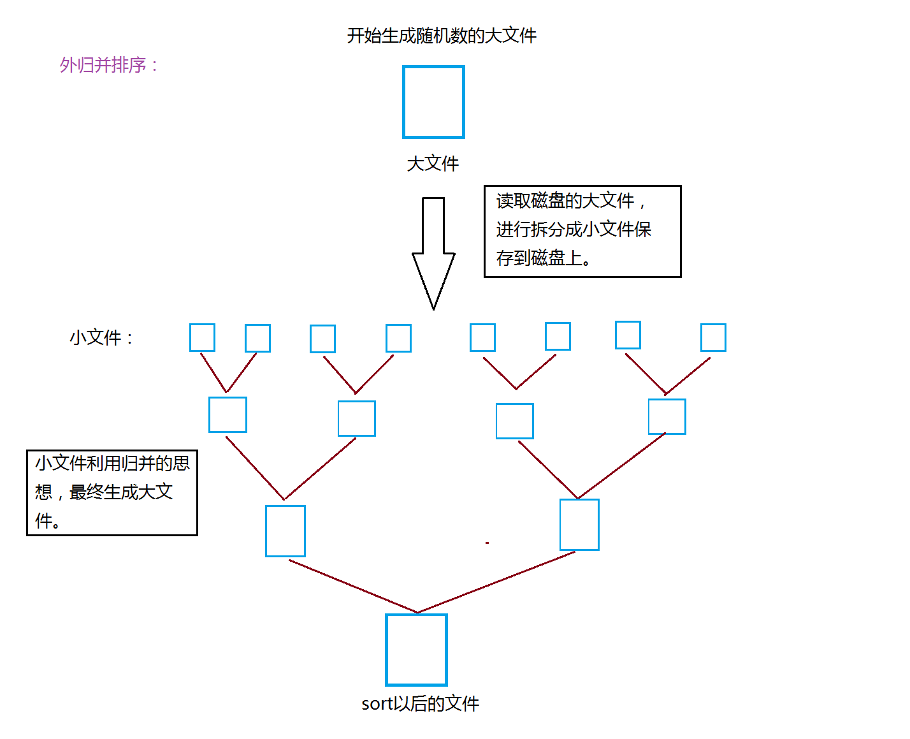

<!-- GFM-TOC -->
* [布隆过滤器](#布隆过滤器)
* [海量数据排序](#海量数据排序)
<!-- GFM-TOC -->

###布隆过滤器
   
布隆过滤器（Bloom filter） 以极小的空间实现数据字典，进行数据判重，集合求交集，有一定的误判概率，主要用于黑名单系统、垃圾邮箱过滤系统，爬虫的网址判重。
Bloom filter 用Bitset存储数据，先用k个hash函数处理得到k个位置，位置值1，查找时，k个位置都为1时表示存在，k和m越大误判率越低。垃圾邮箱的误判可以用白名单补救。

  
 

误判率为：<https://blog.csdn.net/wxb880114/article/details/81110400>

###海量数据排序
外归并排序：针对海量数据（无法一次性加载到内存中），将数据切分成多个文件，然后当个文件内部排序，多个文件外部采用多路归并排序。

  
 
