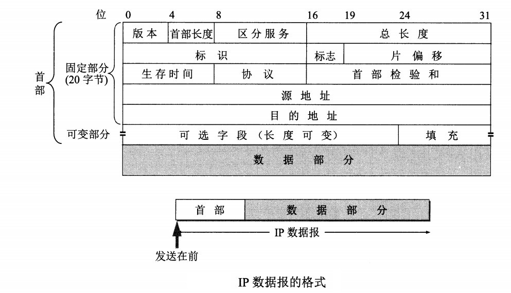
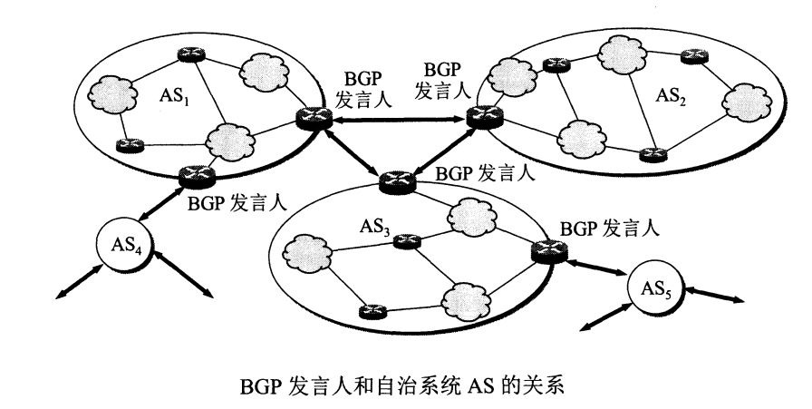
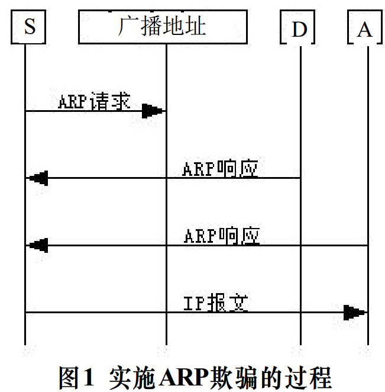

<!-- GFM-TOC -->
* [一、应用层](#一-应用层)
    * [HTTP协议](#http协议)
    * [HTTP1.0、HTTP1.1和HTTP2.0区别](#http1.0-http1.1和http2.0区别)
    * [HTTP和HTTPS区别](#http和https区别)
    * [HTTPS的安全性实现](#https的安全性实现)
    * [cookie和session](#cookie和session)
* [二、传输层](#二-传输层)
    * [UDP协议](#udp协议)
    * [TCP协议](#tcp协议)
        * [TCP和UDP的区别](#tcp和udp的区别)
        * [UDP实现可靠传输——应用层](#udp实现可靠传输——应用层)
* [三、网络层](#三-网络层)
    * [IP数据报格式](#ip数据报格式)
    * [路由选择](#路由选择)
    * [地址解析协议ARP](#地址解析协议arp)
        * [ARP解析过程](#arp解析过程)
        * [ARP诈骗](#arp诈骗)
* [四、数据链路层](#四-数据链路层)
* [五、物理层](#五-物理层)
* [交换机与路由器区别](#交换机与路由器区别)
* [如何及时发现客户端和服务端断开连接](#如何及时发现客户端和服务端断开连接)
* [用户掉线检测](#用户掉线检测)
<!-- GFM-TOC -->
# 一、应用层
## HTTP协议
### HTTP1.0和HTTP1.1区别
1. 缓存处理
    在HTTP1.0中主要使用header里的If-Modified-Since,Expires来做为缓存判断的标准，HTTP1.1则引入了更多的缓存控制策略例如Entity tag，If-Unmodified-Since, If-Match, If-None-Match等更多可供选择的缓存头来控制缓存策略。
2. 带宽优化及网络连接的使用
    HTTP1.1加入range头部允许资源分块传递，支持断点续传，即返回码是206（Partial Content），HTTP1.1只允许传送整个对象。
3. 错误通知的管理
    在HTTP1.1中新增了24个错误状态响应码，如409（Conflict）表示请求的资源与资源的当前状态发生冲突；410（Gone）表示服务器上的某个资源被永久性的删除。
4. Host头处理
    在HTTP1.0中认为每台服务器都绑定一个唯一的IP地址，因此，请求消息中的URL并没有传递主机名（hostname）。但随着虚拟主机技术的发展，在一台物理服务器上可以存在多个虚拟主机（Multi-homed Web Servers），并且它们共享一个IP地址。HTTP1.1的请求消息和响应消息都应支持Host头域，且请求消息中如果没有Host头域会报告一个错误（400 Bad Request）。
5. 长连接
    HTTP 1.1支持长连接（PersistentConnection）和请求的流水线（Pipelining）处理，在一个TCP连接上可以传送多个HTTP请求和响应，减少了建立和关闭连接的消耗和延迟，在HTTP1.1中默认开启Connection： keep-alive，一定程度上弥补了HTTP1.0每次请求都要创建连接的缺点
### HTTP2.0和HTTP1.X相比的新特性
1. 新的二进制格式（Binary Format）
    HTTP1.x的解析是基于文本。基于文本协议的格式解析存在天然缺陷，文本的表现形式有多样性，要做到健壮性考虑的场景必然很多，二进制则不同，只认0和1的组合。基于这种考虑HTTP2.0的协议解析决定采用二进制格式，实现方便且健壮。
2. 多路复用（MultiPlexing）
    即连接共享，即每一个request都是是用作连接共享机制的。一个request对应一个id，这样一个连接上可以有多个request，每个连接的request可以随机的混杂在一起，接收方可以根据request的 id将request再归属到各自不同的服务端请求里面。
3. header压缩
    如上文中所言，对前面提到过HTTP1.x的header带有大量信息，而且每次都要重复发送，HTTP2.0使用encoder来减少需要传输的header大小，通讯双方各自cache一份header fields表，既避免了重复header的传输，又减小了需要传输的大小。
4. 服务端推送（server push）
    同SPDY一样，HTTP2.0也具有server push功能。
### HTTP和HTTPS区别
http(超文本传输协议，端口80) 和 https（超文本传输安全协议，端口443）
https = http + 加密(SSL) + 认证(数字证书) + 完整性保护(数字证书) 。 
http协议缺点：（明文传输，内容可被窃听，不验证通信放的算法，可能遭遇跨站请求伪造，无法验证报文的完整性，可能已被篡改[运营商劫持]）
http协议：基于请求和响应模式、无状态的应用层协议，常基于TCP连接。
### HTTPS的安全性实现

#### cookie和session
cookie机制采用的是在客户端保持状态的方案，而session机制采用的是在服务器端保持状态的方案。
session机制是一种服务器端的机制，服务器使用一种类似于散列表的结构（也可能就是使用散列表）来保存信息，包含唯一的session id.
区别：
1. cookie数据存放在客户的浏览器上，session数据放在服务器上。
2. cookie不是很安全，别人可以分析存放在本地的COOKIE并进行COOKIE欺骗。考虑到安全应当使用session。
3. session会在一定时间内保存在服务器上。当访问增多，会比较占用你服务器的性能。考虑到减轻服务器性能方面，应当使用COOKIE。
4. 单个cookie保存的数据不能超过4K，很多浏览器都限制一个站点最多保存20个cookie。
将登陆信息等重要信息存放为SESSION，其他信息如果需要保留，可以放在COOKIE中
# 二、传输层
## UDP协议
## TCP协议
### TCP和UDP的区别

### UDP实现可靠传输——应用层
实现确认机制、重传机制、窗口确认机制。
1. 添加seq/ack机制，确保数据发送到对端（发送端发送数据时，随机生成一个x，然后每一片按数据大小分配seq，数据到达接收端，接收端将其放入缓存，并发送一个ack=x的确认包，发发送端收到ack包后，删除缓冲区对应的数据）
2. 添加发送和接收缓存区，主要是用户超时重传
3. 添加超时重传机制
现在有三种应用层协议RUDP，RTP，UDT
    基于UDP的数据传输协议（UDP-basedData Transfer Protocol，简称UDT）是一种互联网数据传输协议。UDT的主要目的是支持高速广域网上的海量数据传输，而互联网上的标准数据传输协议TCP在高带宽长距离网络上性能很差。
# 三、网络层
## IP数据报格式
<div align="center">  </div><br>

- **版本** ： 值有4：IPv4, 6(IPv6)
- **首部长度** ：占4位，值1表示32位字的长度，即4字节，所以首部的固定长度位20自建。
- **总长度** ： 占16位，2^16 = 64k——IP数据报的最大长度。
- **标识** ：  在数据报长度过长从而发生分片的情况下，相同数据报的不同分片具有相同的标识符
- **片偏移** ：和标识符一起，用于发生分片的情况。片偏移的单位为 8 字节
- **生存时间** ： TTL,以路由器条数为单位，防止无法交付的树数据报在互联网中不断兜圈子，TTL=0，即为丢弃报文。
- **协议** ： 携带的数据上交给哪个协议处理，如ICMP，TCP，UDP等。
- **首部校验和** ：数据报每经过一个路由器，都要重新计算校验和（不包含数据部分，减少计算的工作量）。

## 路由选择
网络层目的从一个目的端向一个源端和一个或多个目的端传输数据。
- 单播路由：一个源端一个目的端
- 多播路由： 一个源端多个目的端。
互联网可以划分为许多较小的自治系统 AS，因此可以把路由选择协议划分为两大类，单播情况下：

    自治系统内部的路由选择(内部网关协议，IGP)：路由选择信息协议(Routing Information Protocol,RIP) 和 开放性最短路优先(Open Shortest Path First,OSPF)
    自治系统间的路由选择：外部网关协议(Border Gateway Protocol,BGP)
### RIP
RIP 是一种基于距离向量的路由选择协议。距离是指跳数，直接相连的路由器跳数为 1。跳数最多为 15，16意味着无限(无连接，不可达)。

RIP 按固定的时间间隔仅和相邻路由器交换自己的路由表，经过若干次交换之后，所有路由器最终会知道到达本自治系统中任何一个网络的最短距离和下一跳路由器地址。


- 对地址为 X 的相邻路由器发来的 RIP 报文，先修改报文中的所有项目，把下一跳字段中的地址改为 X，并把所有的距离字段加 1；
- 对修改后的 RIP 报文中的每一个项目，进行以下步骤：
    - 若原来的路由表中没有目的网络 N，则把该项目添加到路由表中；
    - 否则：若下一跳路由器地址是 X，则把收到的项目替换原来路由表中的项目；否则：若收到的项目中的距离 d 小于路由表中的距离，则进行更新；否则什么也不做。
    - 若 3 分钟还没有收到相邻路由器的更新路由表，则把该相邻路由器标为不可达，即把距离置为 16。

RIP 协议实现简单，开销小。但是 RIP 能使用的最大距离为 15，限制了网络的规模。并且当网络出现故障时，要经过比较长的时间才能将此消息传送到所有路由器
### OSPF
开放最短路径优先 OSPF，是为了克服 RIP 的缺点而开发出来的。开放表示 OSPF 不受某一家厂商控制，而是公开发表的。
最短路径优先表示使用了 Dijkstra 提出的最短路径算法SPF的特点：
- 向本自治系统中的所有路由器发送信息，这种方法是洪泛法。
- 发送的信息就是与相邻路由器的链路状态，链路状态包括与哪些路由器相连以及链路的度量，度量用费用、距离、时延、带宽等来表示。
- 只有当链路状态发生变化时，路由器才会发送信息。
所有路由器都具有全网的拓扑结构图，并且是一致的。相比于 RIP，OSPF 的更新过程收敛的很快。
### BGP
AS 之间的路由选择很困难，主要是由于：
- 互联网规模很大；
- 各个 AS 内部使用不同的路由选择协议，无法准确定义路径的度量；
- AS 之间的路由选择必须考虑有关的策略，比如有些 AS 不愿意让其它 AS 经过。

BGP 只能寻找一条比较好的路由，而不是最佳路由。每个 AS 都必须配置 BGP 发言人，通过在两个相邻 BGP 发言人之间建立 TCP 连接来交换路由信息。
<div align="center">  </div><br>

## 地址解析协议ARP
网络层实现主机之间的通信，而链路层实现具体每段链路之间的通信。因此在通信过程中，IP 数据报的源地址和目的地址始终不变，而 MAC 地址随着链路的改变而改变。
ARP协议实现由IP地址得到MAC地址
<div align="center">  </div><br>

### ARP解析过程
每个主机都有一个ARP高速缓存，里面有本局域网上的各主机和路由器的IP地址到MAC地址的映射表。
如果主机A知道主机B的IP 地址，但是ARP高速缓存中没有该IP地址到MAC地址的映射，此时主机A通过广播的方式发送ARP请求分组，主机B收到该请求后会发送ARP响应分组给主机A告知其MAC地址，随后主机A向其高速缓存中写入主机B的IP地址到MAC地址的映射,局域网数据传输依靠的是MAC地址。
<div align="center">  </div><br>

### ARP诈骗
核心思想：向目标主机发送伪造的ARP应答，使目标主机中保存伪造的IP地址和MAC地址的映射对。

S——源主机，被欺骗的主机；D——目的主机；A——攻击者，ARP诈骗
<div align="center">  </div><br>

当S向D发送数据时，假设目前他的ARP缓存中没有关于D的记录，那么他首先在局域网中广播包含D的IP地址的ARP请求。假设此时A具有与D相同的IP地址，于是分别来自A与D的ARP响应报文将相继到达S。如果A控制自己的ARP响应晚于D的ARP响应到达S， S将如下伪造映射：D的IP地址 → A的MAC地址保存在ARP缓存中。在该记录过期之前，凡是S发送给D的数据实际上都将发送给A。 而S却毫不察觉。或者A在上述过程中，利用其它方法直接抑制来自D的ARP应答将是一个更有效的方法而不用依赖于不同操作系统的处理机制。进一步，A可不依赖于上述过程，直接在底层伪造ARP响应报文来达到同样的目的。

从影响网络连接通畅的方式来看，ARP欺骗分为二种，一种是对路由器ARP表的欺骗；另一种是对内网PC的网关欺骗。
ARP欺骗攻击的后果非常严重，大多数情况下会造成大面积掉线；如果是被中间人攻击，截取Internet与这个目标主机的之间的全部通信，则会导致信息泄露，在主机看来访问外部服务的响应变慢；或者对于服务器而言，上层应用忙于处理这种异常而无法响应外来请求。

#### ARP诈骗的防范
1. 主机级被动检测：
    当系统接收到来自局域网上的ARP请求时，系统检查该请求发送端的IP地址是否与自己的IP地址相同。如果相同，则说明该网络上另有一台机器与自己具有相同的IP地址。
2. 主机级主动检测：
    主机定期向所在局域网发送查询自己IP地址的ARP请求报文。如果能够收到另一ARP响应报文，则说明该网络上另有一台机器与自己具有相同的IP地址。
3. 服务器级检测：
    当服务器收到ARP响应时，为了证实它的真实性，根据反向地址解析协议(RARP)就用从响应报文中给出的MAC地址再生成一个RARP请求，它询问这样一个问题：“如果你是这个MAC地址的拥有者，请回答你的IP地址”。这样就会查询到这个MAC地址对应的IP地址，比较这两个IP地址，如果不同，则说明对方伪造了ARP响应报文。
4. 网络级检测：
    配置主机定期向中心管理主机报告其ARP缓存的内容。这样中心管理主机上的程序就会查找出两台主机报告信息的不一致，以及同一台主机前后报告内容的变化。这些情况反映了潜在的安全问题。或者利用网络嗅探工具连续监测网络内主机硬件地址与IP地址对应关系的变化。

# 四、数据链路层

## PPP协议
# 五、物理层

#### 如何及时发现客户端和服务端断开连接
server端是绝对被动的，sever端不能主动断开连接。也没有连接链路维持包之类的。client端发送数据的时间也是不定的。在socket连接断开后， server要能够感知到并释放资源。

方法一：当使用 select()函数测试一个socket是否可读时，如果select()函数返回值为1，且使用recv()函数读取的数据长度为0 时，就说明该socket已经断开。
为了更好的判定socket是否断开，我判断当recv()返回值小于等于0时，socket连接断开。但是还需要判断 errno是否等于 EINTR 。如果errno == EINTR 则说明recv函数是由于程序接收到信号后返回的，socket连接还是正常的，不应close掉socket连接。

方法二：
```c++
我的方法不一样，我用getsockopt来判断，还是蛮准确的 
int SocketConnected(int sock) 
{ 
    if(sock<=0) 
        return 0; 
    struct tcp_info info; 
    int len=sizeof(info); 
    getsockopt(sock, IPPROTO_TCP, TCP_INFO, &info, (socklen_t *)&len); 
    if((info.tcpi_state==TCP_ESTABLISHED)) 
    { 
        //myprintf("socket connected\n"); 
        return 1; 
    } 
    else 
    { 
        //myprintf("socket disconnected\n"); 
        return 0; 
    } 
}
```
#### 用户掉线检测
1. SO_KEEPALIVE 机制
    这是socket库提供的功能，设置接口是setsockopt API：
    如果为socket设置了KEEPALIVE选项，TCP/IP栈在检测到对方掉线后，任何在该socket上进行的调用(发送/接受调用)就会立刻返回，错误号是WSAENETRESET；
    缺点： 默认设置是空闲2小时才发送一个“保持存活探测分节”，不能保证实时检测！
2. SIO_KEEPALIVE_VALS 机制
    设置接口是WSAIoctl API；
    该选项不同于SO_KEEPALIVE机制的，它是针对单个连接的，对系统其他的套接口并不影响。当网络连接断开后，TCP STACK并不主动告诉上层的应用程序，但是当下一次RECV或者SEND操作进行后，马上就会返回错误告诉上层这个连接已经断开了；如果检测到断开的时候，在这个连接上有正在PENDING的IO操作，则马上会失败返回。
    缺点：不通用啦。MS的API只能用于Windows
3. Heart-beat线程
    一个后台线程，实现Heart-Beat包，客户端受到该包后，立刻返回相应的反馈包
    缺点：会改变现有的通讯协议
#### tcp会自动断开连接吗？
    TCP的保活定时器能够保证TCP连接一直保持，但是TCP的保活定时器不是每个TCP/IP协议栈就实现了。